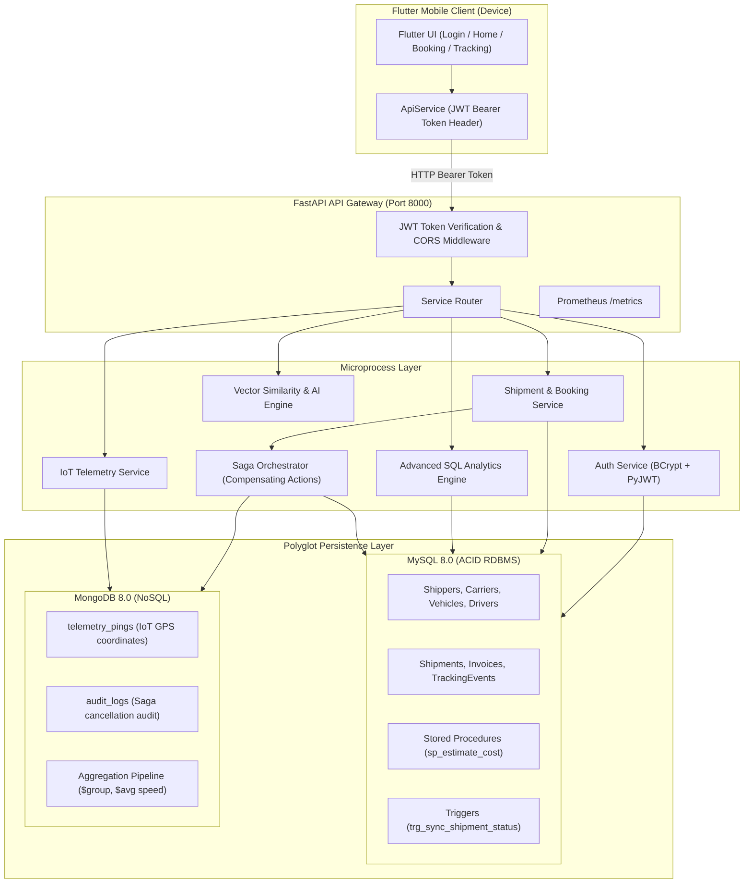

# 🚀 ShipEasy: Distributed Logistics Microservices & Mobile App

ShipEasy is an enterprise-grade, polyglot logistics management platform built to fulfill the comprehensive **CO1 through CO6** Database & Backend Engineering syllabus. It features a modern **Flutter mobile client**, a **FastAPI microservices backend**, **JWT token-based authentication**, **MySQL (RDBMS ACID transactions)**, and **MongoDB (IoT GPS telemetry and aggregation pipelines)**.

---

## 📋 Table of Contents
1. [Architecture Overview & Microprocesses](#architecture-overview--microprocesses)
2. [Syllabus Mapping (CO1 to CO6)](#syllabus-mapping-co1-to-co6)
3. [Key Solutions Implemented](#key-solutions-implemented)
   - [1. Mobile Map Fixes](#1-mobile-map-fixes)
   - [2. 5-Hour & Picked-Up Cancellation Business Logic](#2-5-hour--picked-up-cancellation-business-logic)
   - [3. Complete Token Authentication Flow](#3-complete-token-authentication-flow)
4. [Project Directory Layout](#project-directory-layout)
5. [Running the Backend (FastAPI + Databases)](#running-the-backend-fastapi--databases)
6. [Running the Flutter Mobile Application](#running-the-flutter-mobile-application)
7. [Running Backend Test Suite](#running-backend-test-suite)
8. [API Endpoints Reference](#api-endpoints-reference)

---

## 🏛️ Architecture Overview & Microprocesses

The system adopts a **Polyglot Persistence Layered Microservice Architecture**:
- **Mobile Client**: Flutter application communicating strictly via signed **JWT Bearer Tokens**.
- **API Gateway**: Central ingress point managing token verification, CORS, rate limiting, and request forwarding.
- **Relational Core (MySQL 8.0)**: Guarantees ACID transactional integrity for users, carriers, vehicles, invoices, and shipment lifecycle states.
- **Document Telemetry Core (MongoDB 8.0)**: High-speed ingestion for IoT GPS pings, driver waypoints, audit streams, and real-time aggregations.
- **Saga Orchestrator**: Handles distributed compensating transactions (e.g. invoice refunds on shipment cancellation).



---

## 📚 Syllabus Mapping (CO1 to CO6)

| Course Outcome | Syllabus Module | Implementation in Project | Source Code Location |
| :--- | :--- | :--- | :--- |
| **CO1** | **RDBMS Foundations & Normalisation** | 3NF normalized schema for Shippers, Carriers, Vehicles, Drivers, Warehouses, Shipments, Invoices with constraints. | [`schema.sql`](file:///D:/DBMSPROJECT/schema.sql), [`sql_models.py`](file:///D:/DBMSPROJECT/backend/app/models/sql_models.py) |
| **CO1** | **Advanced SQL Querying** | Common Table Expressions (CTEs), multi-table JOINs, and Window Functions (`DENSE_RANK()`, `ROW_NUMBER()`, `SUM() OVER ()`). | [`analytics.py`](file:///D:/DBMSPROJECT/backend/app/api/analytics.py#L9-L55) |
| **CO1** | **Transactions & Stored Logic** | ACID transactions with rollback, stored procedures (`sp_estimate_cost`), status sync triggers (`trg_sync_shipment_status`). | [`schema.sql`](file:///D:/DBMSPROJECT/schema.sql#L97-L122), [`shipment_service.py`](file:///D:/DBMSPROJECT/backend/app/services/shipment_service.py#L10-L30) |
| **CO2** | **Document Engineering (MongoDB)** | BSON document store, compound indexing, CRUD operations on real-time driver coordinates. | [`tracking.py`](file:///D:/DBMSPROJECT/backend/app/api/tracking.py#L11-L32), [`database.py`](file:///D:/DBMSPROJECT/backend/app/database.py#L38-L47) |
| **CO2** | **Aggregation Pipeline** | Multi-stage pipeline (`$match`, `$group`, `$project`) computing total pings, average speed, max speed, and trip duration. | [`tracking.py`](file:///D:/DBMSPROJECT/backend/app/api/tracking.py#L42-L86) |
| **CO2** | **Polyglot Persistence** | Relational transactions in MySQL + streaming unconstrained IoT pings in MongoDB. | [`shipments.py`](file:///D:/DBMSPROJECT/backend/app/api/shipments.py#L168-L180) |
| **CO2** | **Vector Database Foundations** | Cargo semantic embeddings, Cosine Similarity metrics, and archetype matching for vehicle recommendation. | [`ai_vector.py`](file:///D:/DBMSPROJECT/backend/app/api/ai_vector.py) |
| **CO3** | **FastAPI Core Framework** | Layered architecture, Pydantic v2 validation contracts, async endpoints, lifespan handlers, CORS & metrics middleware. | [`main.py`](file:///D:/DBMSPROJECT/backend/app/main.py), [`pydantic_schemas.py`](file:///D:/DBMSPROJECT/backend/app/models/pydantic_schemas.py) |
| **CO3** | **Authentication & Security** | JWT tokens with HMAC-SHA256, OAuth2 Bearer scheme, salted BCrypt password hashing, protected routes. | [`security.py`](file:///D:/DBMSPROJECT/backend/app/security.py), [`auth.py`](file:///D:/DBMSPROJECT/backend/app/api/auth.py), [`deps.py`](file:///D:/DBMSPROJECT/backend/app/api/deps.py) |
| **CO3** | **Testing & Quality Assurance** | Automated test suite verifying auth tokens, booking flows, 5-hour cutoff, and MongoDB pipelines. | [`test_backend.py`](file:///D:/DBMSPROJECT/backend/app/tests/test_backend.py) |
| **CO4** | **Multi-Framework Backend Design** | Service boundaries, decoupled modules, token forwarding between microprocesses. | [`backend/microservices/`](file:///D:/DBMSPROJECT/backend/microservices) |
| **CO5** | **Microservices & API Gateway** | Centralized API gateway validating tokens and routing traffic to independent microprocesses. | [`api_gateway.py`](file:///D:/DBMSPROJECT/backend/microservices/api_gateway.py) |
| **CO5** | **Distributed Concepts & Saga** | Saga pattern with compensating actions: cancelling shipment triggers invoice refund and MongoDB audit log. | [`saga_orchestrator.py`](file:///D:/DBMSPROJECT/backend/app/services/saga_orchestrator.py) |
| **CO6** | **Containerisation & Assembly** | Multi-container Docker Compose file assembling MySQL, MongoDB, FastAPI Backend, and Prometheus. | [`Dockerfile`](file:///D:/DBMSPROJECT/backend/Dockerfile), [`docker-compose.yml`](file:///D:/DBMSPROJECT/backend/docker-compose.yml) |
| **CO6** | **Observability & Monitoring** | OpenTelemetry/Prometheus metrics endpoint (`/metrics`) exposing latency histograms and request counters. | [`main.py`](file:///D:/DBMSPROJECT/backend/app/main.py#L11-L48), [`prometheus.yml`](file:///D:/DBMSPROJECT/backend/prometheus.yml) |

---

## 🛠️ Key Solutions Implemented

### 1. Mobile Map Fixes
- **Root Cause Identified**:
  - `AndroidManifest.xml` lacked `<uses-permission android:name="android.permission.INTERNET"/>` and `<uses-permission android:name="android.permission.ACCESS_NETWORK_STATE"/>`, causing Android to block OpenStreetMap tile fetching.
  - `latlong2` was missing from `pubspec.yaml`.
  - `track_shipment_screen.dart` was missing a map view widget.
- **Resolution**:
  - Added permissions and `android:usesCleartextTraffic="true"` in [`AndroidManifest.xml`](file:///D:/DBMSPROJECT/frontend/shipeasycode/android/app/src/main/AndroidManifest.xml).
  - Added `latlong2: ^0.10.1`, `http: ^1.6.0`, and `shared_preferences: ^2.5.5` to [`pubspec.yaml`](file:///D:/DBMSPROJECT/frontend/shipeasycode/pubspec.yaml).
  - Embedded an interactive `FlutterMap` in [`track_shipment_screen.dart`](file:///D:/DBMSPROJECT/frontend/shipeasycode/lib/screens/track_shipment_screen.dart) displaying:
    - **Green Pin**: Origin / Pickup location
    - **Blue Truck Icon**: Real-time GPS location
    - **Red Pin**: Destination / Drop location
    - **Polyline Layer**: Route path between points

### 2. 5-Hour & Picked-Up Cancellation Business Logic
- **Rules Enforced in Backend & Mobile**:
  1. **Strict 5-Hour Window**: If `elapsed_time > 5 hours`, cancellation is rejected (`400 Bad Request: The 5-hour cancellation window has expired`).
  2. **Picked-Up Lock**: If status is `'picked_up'`, `'in_transit'`, `'out_for_delivery'`, or `'delivered'`, cancellation is blocked (`400 Bad Request: This shipment has already been picked up and cannot be cancelled`).
  3. **Compensating Action (Saga)**: On valid cancellation, shipment status becomes `'cancelled'`, a cancellation tracking event is added, the invoice status is updated to `'refunded'`, and an audit log is stored in MongoDB.
  4. **Dynamic Mobile UI**: Displays remaining cancellation time countdown, confirmation alert dialog, and locks/disables button once picked up.

### 3. Complete Token Authentication Flow
- All communications between mobile device and backend utilize **JWT Bearer Tokens**:
  - `POST /api/auth/register` & `POST /api/auth/login` issue signed JWT tokens containing `shipper_id` and `sub`.
  - Tokens are stored locally on device via `SharedPreferences`.
  - Every API call from [`api_service.dart`](file:///D:/DBMSPROJECT/frontend/shipeasycode/lib/services/api_service.dart) attaches `Authorization: Bearer <token>`.
  - FastAPI dependency [`get_current_shipper`](file:///D:/DBMSPROJECT/backend/app/api/deps.py#L21-L55) decrypts and validates token claims on each database fetch.

---

## 🚀 Running the Backend (FastAPI + Databases)

### Prerequisites:
- Python 3.10+ or 3.13+ installed (`py --version`).
- MySQL 8.0 running on port 3306.
- MongoDB running on port 27017.

### Start Backend Server:
```powershell
cd D:\DBMSPROJECT\backend
py -m uvicorn app.main:app --host 0.0.0.0 --port 8000 --reload
```
- Interactive Swagger API Documentation: [http://127.0.0.1:8000/api/docs](http://127.0.0.1:8000/api/docs)
- Prometheus Metrics: [http://127.0.0.1:8000/metrics](http://127.0.0.1:8000/metrics)

---

## 📱 Running the Flutter Mobile Application

### Step 1: Open project directory
```powershell
cd D:\DBMSPROJECT\frontend\shipeasycode
```

### Step 2: Fetch dependencies & verify analysis
```powershell
flutter pub get
flutter analyze
```
*(Result: `No issues found!`)*

### Step 3: Launch on your preferred device
```powershell
# Run on Windows Desktop
flutter run -d windows

# Run on Android Emulator or connected USB Device
flutter run -d android

# Run on Chrome Web Browser
flutter run -d chrome
```

---

## 🧪 Running Backend Test Suite
The automated test suite verifies token authentication, the 5-hour cancellation rule, picking-up restrictions, MongoDB aggregations, and advanced SQL analytics:

```powershell
cd D:\DBMSPROJECT\backend
py -m pytest app/tests/test_backend.py -v
```

---

## 📡 API Endpoints Reference

### 1. Authentication (`/api/auth`)
- `POST /api/auth/register`: Create shipper account & obtain JWT token.
- `POST /api/auth/login`: Authenticate credentials & return JWT token.
- `GET /api/auth/me`: Fetch authenticated shipper profile (`Bearer <token>` required).

### 2. Shipments & Cancellation (`/api/shipments`)
- `GET /api/shipments`: Fetch authenticated user's shipments with status and cancel eligibility.
- `POST /api/shipments`: Book new shipment, auto-assign carrier/vehicle, create invoice.
- `GET /api/shipments/{id}`: Detailed shipment view with tracking timeline.
- `POST /api/shipments/{id}/cancel`: Cancel shipment enforcing **5-hour window** & **picked-up lock**.
- `POST /api/shipments/estimate-cost`: Stored procedure cost calculation.

### 3. IoT Live Tracking (`/api/tracking`)
- `POST /api/tracking/ping`: Ingest real-time driver GPS coordinates into MongoDB.
- `GET /api/tracking/{id}/pings`: Fetch coordinate history.
- `GET /api/tracking/{id}/analytics`: Run MongoDB Aggregation Pipeline for speed and route metrics.

### 4. Advanced Analytics & AI (`/api/analytics` & `/api/ai`)
- `GET /api/analytics/carrier-rankings`: Advanced SQL with Window Functions (`DENSE_RANK`).
- `GET /api/analytics/monthly-revenue-cte`: Advanced SQL with Common Table Expressions (CTEs).
- `POST /api/ai/classify-cargo`: Vector embedding & Cosine Similarity for cargo classification.
